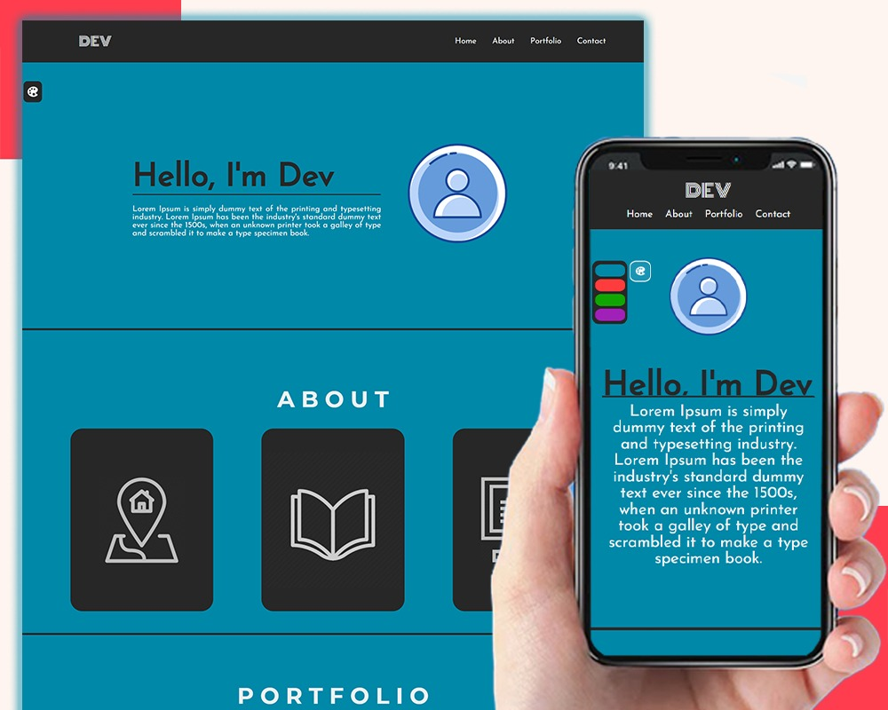
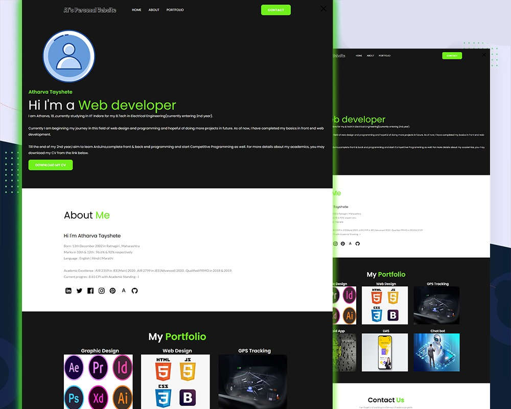

# IITISoC--Personal-Website-Project---Team-2
>The link to our project : https://personal-website-iitisoc.herokuapp.com/
___

## **Team** :

1. Dev Daftari
1. Ashish Agrawal
1. Atharva Tayshete
1. Avaneesh Pandey

## **Mentor** : Kuldeep Singh
___
## **Project Overview** :

This is a personal website but with a twist ! <br /> 
On every refresh you get greeted by a newly generated stylesheet. This has been implemented by making use of
```javascript
    const num = Math.floor(Math.random()*4)
```
The above code generates a random number between 0-3 which links the css file to the index.html file by the use of javascript. 
```javascript
    document.getElementById('css_sheet').setAttribute('href', `./style/${num}/${num}.css`);
```
This number also determines the javascript code to be linked to the file.
```javascript
    if(num === 0){
        //javascript for 1st stylesheet
    }else if(num === 1){
        //javascript for 2nd stylesheet
    }
    else if(num === 2){
        //javascript for 3rd stylesheet
    }
    else if(num === 3){
        //javascript for 4th stylesheet
    }
```
You would notice that all the stylesheets have different html despite of the fact that there is only one html file. This has also been implemented by the use of javascript.</br>
For example:
```javascript
    document.getElementById("heading").innerHTML = "Hello, I'm Dev";
```
```javascript
    const div_about = document.createElement("div");
    div_about.setAttribute("id", "abt_main");
    document.querySelector("#about").appendChild(div_about);
```    
```javascript
    const iconlink = `<link rel="icon" href="./style/0/icon1.png" type="image/icon type">`;
    document.getElementById("css_sheet").insertAdjacentHTML("afterend", iconlink);
```
___
## **Skills** : 
* HTML
* CSS
* JavaScript
* Git / GitHub
* Hosting through Heroku
___
## **Preview** :


___

___

___

___

## **Download Links** : 
You can access our project form your local machine !
>https : https://github.com/Dev-Daftari/IITISoC--Personal-Website-Project---Team-2.git

```bash
    git clone https://github.com/Dev-Daftari/IITISoC--Personal-Website-Project---Team-2.git
```
___
# Thank You for your time !
